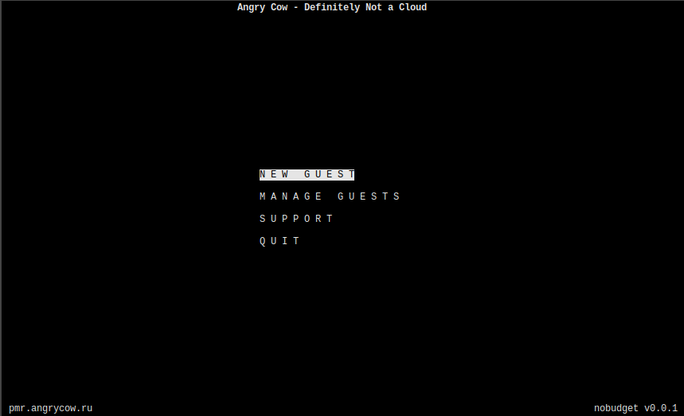

# No Budget

_text-mode user interface for [convergent DRBD/XEN farms](https://github.com/pbraun9/dnc)_

<!-- dropping netbsd and nis for now
_tested on netbsd93_

# Overview

To be highly available, No Budget requires at least two nodes e.g.

        ypmaster
        ypslave

The nobudget text-mode user interface can be balanced on both, however there's only one NIS master at a time, this is why
NIS user creation is only done on the NIS master (see nobudget-register.ksh which checks which master there is before call
ing it).

## Permission model

There is a specific `register` user on both nis/nobudget nodes for prospects to create user accounts.
This user has the rights to call the `nobudget-update-nis.ksh` and `nobudget-pubkey.ksh` scripts (see sudoers setup).

## Requirements

- a NIS master (and eventually a NIS slave, with the ability to ssh as root to one another)
- a few packages (`pwgen`, `ksh93`, `sudo`)
- a working outbound email system
-->

## System preparation

see [SYSPREP](SYSPREP)

## Installation

see [INSTALL](INSTALL)

